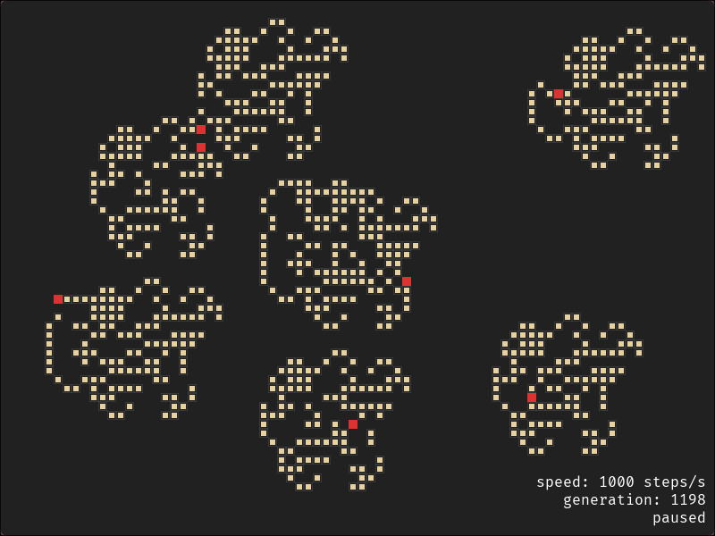

<h1 align="center">Langton's Ants</h1>
<p align="center">A Langton's Ant simulation in C++20 with SDL3, supporting multiple ants and a clean dark UI.</p>
<p align="center">  </p>

## Features

- **Langton's Rules** — classic two-rule automaton on a wrap-around grid
- **Multiple Ants** — click to add or remove ants anywhere on the grid
- **Emergent Behavior** — after ~10,000 steps, ants spontaneously build an infinite diagonal highway
- **Interactive** — pause/resume, reset, and adjust simulation speed at runtime
- **HUD** — displays generation count and current speed in steps/second

## Controls

| Input | Action |
|---|---|
| `Space` | Pause / Resume |
| `R` | Reset grid and ants |
| `M` | Increase speed |
| `N` | Decrease speed |
| `Left Click` | Add ant (or remove if already there) |
| `Escape` | Quit |

## Building

**Dependencies:**
- CMake 3.20+
- SDL3
- SDL3_ttf

```bash
git clone https://github.com/JJ0o0/LangtonAnts
cd LangtonAnts
cmake -B build
cmake --build build
./build/app
```

## Project Structure

```
LangtonAnts/
├── assets/
│   └── fonts/
├── include/LangtonAnts/
│   ├── core/
│   │   ├── App.hpp        # Main application loop
│   │   ├── Ant.hpp        # Ant struct (position, direction, step)
│   │   └── Grid.hpp       # Simulation grid
│   └── utilities/
│       ├── Colors.hpp     # Color constants
│       ├── UI.hpp         # Text rendering utilities
│       └── Utils.hpp      # Direction enum, string formatting
└── src/
    ├── core/
    │   ├── App.cpp
    │   ├── Ant.cpp
    │   └── Grid.cpp
    ├── utilities/
    │   ├── UI.cpp
    │   └── Utils.cpp
    └── main.cpp
```

## Architecture

`Grid` owns the cellular automaton — a `std::vector<bool>` representing black/white cells on a toroidal (wrap-around) grid, rendered centered on the screen. `Ant` is a lightweight struct holding position and direction, with a `step()` method that applies Langton's two rules and moves the ant. `App` drives the game loop, owns the grid and the `std::vector<Ant>`, and delegates rendering and event handling. `UI` and `Utils` are stateless namespaces with free functions for text rendering and string formatting.

## License

[MIT](LICENSE)